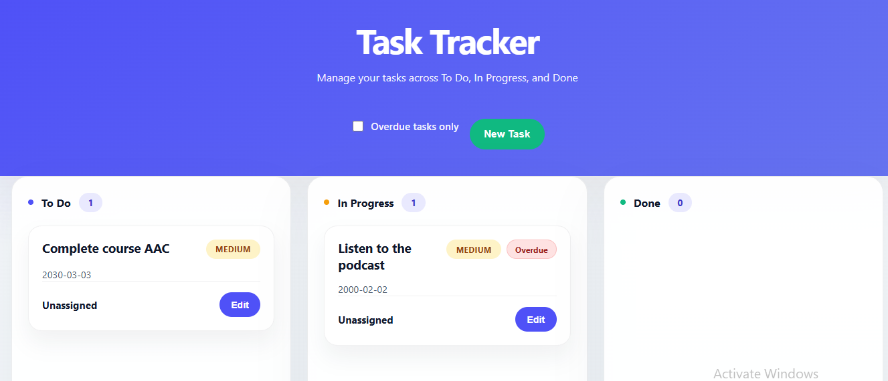
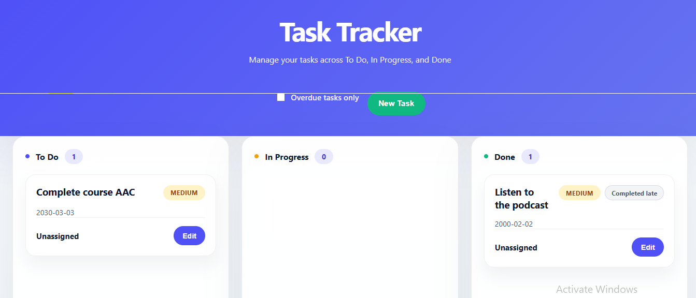
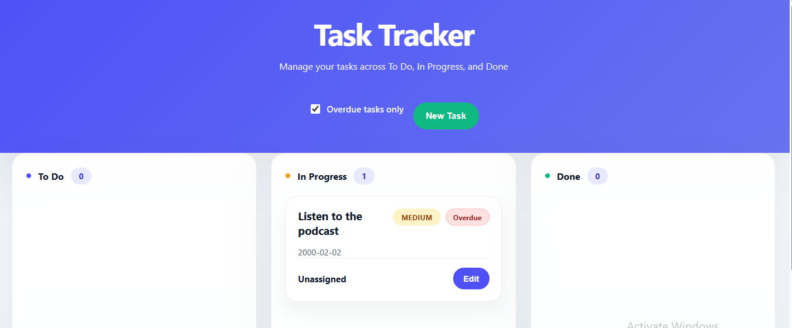

# Verification

## Baseline (before mid-course project changes)
- Date: 19 July 2026
- Branch: mid-course-project (created from main @ f65c5e4)
- pytest result: 18 passed, 2 warnings in 0.32s
- Manual browser check: server runs on :8000, board loads, create / drag / edit / delete a task all work correctly

## Feature 1: Due Dates + Overdue Filter

---

### Full Pytest Suite (after feature + date-fix)

```
pytest
29 passed, 2 warnings in 0.39s
```

New tests added (10):

| Test name | What it proves |
|---|---|
| test_create_task_with_valid_due_date_returns_201_and_echoes_date | Valid date accepted, echoed in response, due_state null for future date |
| test_create_task_without_due_date_returns_201_with_null_due_date | due_date and due_state both null when omitted |
| test_create_task_invalid_due_date_format_returns_422_naming_due_date | 422 detail loc names due_date field |
| test_past_due_date_not_done_has_due_state_overdue | Past date + non-Done → due_state == "overdue" |
| test_past_due_date_done_has_due_state_completed_late | Past date + Done → due_state == "completed_late" via valid transition chain |
| test_patch_due_date_updates_value | PATCH sets a new due_date correctly |
| test_patch_due_date_null_clears_value | PATCH with null clears due_date and due_state |
| test_patch_without_due_date_leaves_existing_date_unchanged | Unrelated PATCH does not touch due_date |
| test_overdue_filter_excludes_completed_late_and_future_tasks | Filter returns exactly one overdue task; excludes completed_late, future, no-date |
| test_overdue_filter_no_matches_returns_200_empty_list | Empty overdue result is 200 with [] |

---

### Break Test Evidence

#### Break Test 1 — Done/completed_late check sabotaged

**What was broken:** In `app/models.py`, inside `due_state`, changed `TaskStatus.DONE`
to `TaskStatus.TODO` in the comparison so the Done branch never matched.

**Expected failures:** tests that assert `due_state == "completed_late"` and the
filter exclusion test.

**Observed failures:**
```
FAILED test_past_due_date_not_done_has_due_state_overdue
       AssertionError: assert 'completed_late' == 'overdue'
FAILED test_past_due_date_done_has_due_state_completed_late
       AssertionError: assert 'overdue' == 'completed_late'
FAILED test_overdue_filter_excludes_completed_late_and_future_tasks
       AssertionError: assert 'overdue' == 'completed_late'
FAILED test_list_tasks_overdue_filter_returns_only_overdue
       AssertionError: (Done task leaked into filter, id mismatch)
```

---

#### Break Test 2 — due_date update path blocked

**What was broken:** In `app/storage.py`, `update_task`, added
`changes.pop("due_date", None)` after `model_dump` so due_date changes were
silently ignored.

**Expected failures:** tests that PATCH due_date to a new value or to null.

**Observed failures:**
```
FAILED test_patch_due_date_updates_value
       AssertionError: assert None == '2026-08-18'
FAILED test_patch_due_date_null_clears_value
       AssertionError: assert '2026-08-18' is None
```

========================================== 29 passed, 2 warnings in 0.39s ====

**After Applying the Break Test to actually test if they work:**

========================================== 6 failed, 23 passed, 2 warnings in 0.63s ========

---

### Manual Browser Checks — Feature 1

Backend: `http://localhost:8000` | Frontend: `http://localhost:5500/frontend/index.html`

| Check | Expected | Result | Evidence |
|---|---|---|---|
| Future-dated card (2030-03-03) shows no pill | Date shown as `YYYY-MM-DD`, no pill | ✅ Pass | Screenshot 1 — "Complete course AAC" in To Do |
| Past-dated card (2000-02-02) in InProgress shows "Overdue" pill | Red-ish "Overdue" pill visible | ✅ Pass | Screenshot 1 — "Listen to the podcast" in InProgress |
| Drag overdue task from InProgress to Done | Pill flips to "Completed late" after re-render | ✅ Pass | Screenshot 2 — same task now in Done column |
| Overdue filter checkbox toggled ON | Only the overdue task shown (InProgress 1); future-dated and completed_late tasks excluded | ✅ Pass | Screenshot 3 — To Do 0, Done 0, InProgress 1 |
| Overdue filter excludes "Complete course AAC" (future date) | Task disappears from board when filter is on | ✅ Pass | Screenshot 3 — To Do column shows 0 |
| Overdue filter excludes "Listen to the podcast" when Done (completed_late) | Completed_late task not shown in filtered view | ✅ Pass | Screenshot 3 — Done column shows 0 |
| POST `{"due_date": "banana"}` via Swagger | HTTP 422, detail names `due_date` in loc | ✅ Pass | Manual Swagger check |
| `GET /tasks?overdue=banana` via Swagger | HTTP 422 | ✅ Pass | Manual Swagger check |
| Edit task, clear due date field, save | Date element and pill disappear from card | ✅ Pass | Manual modal check |
| Stop backend, toggle filter on | Error state shown, board does not crash | ✅ Pass | Manual DevTools check |

**Screenshot 1 — Normal board (filter off):**



Two tasks: "Complete course AAC" (To Do, future date 2030-03-03, no pill) and
"Listen to the podcast" (InProgress, past date 2000-02-02, "Overdue" pill). Done = 0.

**Screenshot 2 — After dragging "Listen to the podcast" to Done:**



Pill correctly flips to "Completed late". InProgress = 0, Done = 1.
"Complete course AAC" unchanged in To Do with no pill (future date).

**Screenshot 3 — Overdue filter checkbox checked:**



Only "Listen to the podcast" (InProgress, Overdue pill) appears.
To Do = 0 (future-dated task excluded), Done = 0 (completed_late task excluded).
Confirms filter hits the backend `?overdue=true` endpoint correctly.

---
